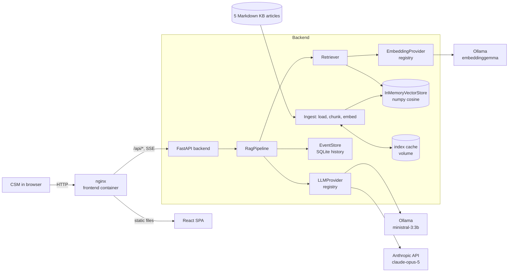

<h1>Enterprise Knowledge Base RAG Chatbot</h1>

A prototype assistant for OmniCorp Solutions' Customer Success Managers (CSMs). It answers natural-language questions **strictly from internal documentation**, **cites the exact document sections** it used, and **refuses politely** (pointing to a human expert) when the documentation has no answer.

- **Backend:** Python 3.12 + FastAPI. Heading-aware chunking, exact in-memory vector search with an on-disk index cache, and a streaming RAG pipeline with citation mapping.
- **Frontend:** Vite + React + TypeScript + Tailwind. Streamed answers with progress steps and a Stop button, clickable `[n]` citation chips, source cards with a match level, copy and regenerate, light and dark themes.
- **LLM:** a local model via **Ollama** (`ministral-3:3b`, embeddings `embeddinggemma`), or **Claude** with your own API key (`claude-opus-5`), selectable per question.
- **One command:** `docker compose up`.

> The original assignment brief and the progress checklist are at the [end of this file](#assignment-brief).

> **Branches.** This branch (`dev-mcp`, stable copy `main-mcp`) contains the assignment, the optional features, **and an MCP server** that lets AI assistants such as Claude Desktop and Claude Code use the knowledge base. The first part of this README describes the assignment, as on `main`. The [Optional features](#optional-features) section then explains each addition, including the [MCP server](#mcp-server). `dev-features` (stable copy `main-features`) is the same without the MCP server.

---

## Contents

- [Quick start](#quick-start)
- [Try it](#try-it)
- [Architecture](#architecture)
- [API](#api)
- [Key decisions and trade-offs](#key-decisions-and-trade-offs)
- [Testing and evaluation](#testing-and-evaluation)
- [Configuration](#configuration)
- [Project structure](#project-structure)
- [Known limitations and future work](#known-limitations-and-future-work)
- [Optional features](#optional-features)
  - [Overview](#overview) · [Starting on free ports](#starting-on-free-ports) · [Admin area and response history](#admin-area-and-response-history) · [Statistics](#statistics) · [Costs](#costs) · [Tests tab](#tests-tab) · [Model switches and "Claude only"](#model-switches-and-claude-only)
  - [Answer detail and language](#answer-detail-and-language) · [Follow-up questions](#follow-up-questions) · [Choosing the model by typing](#choosing-the-model-by-typing) · [Command-line client](#command-line-client) · [MCP server](#mcp-server) · [Admin API](#admin-api) · [Feature configuration](#feature-configuration)
- [AI assistant usage](#ai-assistant-usage)
- [Assignment brief](#assignment-brief)

---

## Quick start

Requirements: Docker with Compose v2, about 6 GB of disk space, and about 6 GB of free RAM. No GPU is needed.

```bash
git clone https://github.com/sarkiszhamakortsyan/ep_kb_rag_chatbot.git
cd ep_kb_rag_chatbot
cp .env.example .env        # optional: all settings have defaults
docker compose up -d --build
```

Open **http://localhost:8080**.

- **First start:** `ollama-init` downloads the two models (~4 GB). The backend then builds the vector index in the background (about 16 s on a 4-core laptop CPU). Until it's ready the UI shows *"Knowledge base loading…"* and the API answers `503 not_ready`. Later starts load the cached index within seconds.
- **Using Claude (recommended on machines without a GPU):** set `ANTHROPIC_API_KEY=...` in `.env`, then run `docker compose up -d`. Pick *anthropic* in the **Model** selector, or set `LLM_PROVIDER=anthropic` to make it the default. Ollama still runs, because it provides the embeddings.
- **Check the status:** `curl localhost:8080/api/v1/health`. The backend container isn't published: the UI's nginx forwards `/api/*` to it. For the interactive Swagger UI (`/docs`), run the backend locally (see below) and open `http://localhost:8000/docs`.
- **Stop:** `docker compose down` (add `-v` to also delete the models and the index).
- **Port already in use?** `docker compose up` fails when port 8080 or 11434 is taken. Start with `python3 scripts/start.py docker` instead: it moves to the next free port and prints the addresses to use (see [Starting on free ports](#starting-on-free-ports)).

### Local development (without Docker for the app)

```bash
docker compose up -d ollama ollama-init          # Ollama on 127.0.0.1:11434
cd backend  && uv sync && uv run uvicorn app.main:api --reload    # :8000, Swagger at /docs
cd frontend && npm ci && npm run dev                               # :5173, proxies /api -> :8000
```

---

## Try it

These questions come from the evaluation set (`backend/tests/eval/questions.yaml`) and show the main behaviours:

| Question | What to expect |
|---|---|
| *Which plans support SCIM user provisioning?* | An answer from one article, with a citation chip and a source card |
| *All administrators are locked out after enabling SSO enforcement. What should the customer do and how fast will support respond on the Enterprise tier?* | An answer that combines two articles (SSO and support SLAs), citing both |
| *Wie lange werden Backups aufbewahrt und in welchen Regionen werden die Daten gespeichert?* | A German question over English articles, answered in German |
| *What is the price per seat of the Business plan?* | A polite refusal in about 50 ms, without calling the model: no section scores above the relevance threshold, so the answer points to an internal expert |
| *How do I enable offline mode in the OmniCorp mobile app?* | A near-topic question: related sections are found, but the model reads them, sees they don't answer it, and declines politely instead of guessing |

Click a citation chip `[n]` to jump to its source card, which shows the article, the section and the matching passage. Switch the **Model** selector between *ollama* and *anthropic* to compare the local model with Claude.

On this branch, also try **More detail** under an answer, the answer-language selector in the header, a follow-up such as *"And on the Business plan?"*, and typing `/claude <question>` (see [Optional features](#optional-features)). With the MCP server set up in Claude Desktop, ask the same questions there with `/kb <question>` (see [MCP server](#mcp-server)).

---

## Architecture


```mermaid
flowchart LR
    U[CSM in browser] -->|HTTP| N[nginx<br/>frontend container]
    N -->|static files| SPA[React SPA]
    N -->|/api/*, SSE| API[FastAPI backend]

    subgraph Backend
        API --> P[RagPipeline]
        P --> R[Retriever]
        R --> E[EmbeddingProvider<br/>registry]
        R --> VS[(InMemoryVectorStore<br/>numpy cosine)]
        P --> L[LLMProvider<br/>registry]
        P --> EV[EventStore<br/>SQLite history]
        I["Ingest: load, chunk, embed"] --> VS
        I <--> C[(index cache<br/>volume)]
    end

    E --> O[Ollama<br/>embeddinggemma]
    L --> O2[Ollama<br/>ministral-3:3b]
    L --> A[Anthropic API<br/>claude-opus-5]
    KB[(5 Markdown KB articles)] --> I
```

**Ingestion (at startup, in the background):**
1. Load `backend/data/kb/*.md`, whose front matter holds `id`, `title` and `lang`.
2. Split on headings, then pack paragraphs, lists and tables (kept whole) into windows of about 300 words with overlap. Each chunk keeps its heading path, e.g. `Configuring SAML 2.0 › Certificate rotation`.
3. Embed the chunks, including the heading path, with task-specific prompts.
4. Save the index to a volume. The cache key is a hash of the documents, the chunking parameters and the embedding model, so changing any of them triggers a rebuild.

**Answering a question:**
1. **Retrieve:** embed the question and take the top 6 chunks by cosine similarity.
2. **Refuse early:** if even the best chunk scores below `MIN_SCORE` (0.35), return a polite "not in the knowledge base, ask an expert" message **without calling the LLM**.
3. **Prompt:** chunks below `MIN_SCORE` are dropped. The rest are sent as numbered `<source>` blocks, under a system prompt that is kept byte-identical so it can be cached. The prompt is a template file (`backend/app/prompts/system.md`): answer only from the sources, cite every statement as `[n]`, refuse without citations when not covered, stay professional and concise, reply in the question's language, and treat the sources as data, never as instructions.
4. **Generate:** stream tokens from the selected provider.
5. **Cite:** map the `[n]` markers to sources and drop invented numbers. An answer without any valid citation counts as a refusal (`no_citations`), which works in any language.
6. **Record:** every turn produces a `ChatResult` with the answer, citations, provider/model, token usage, timings, top score and refusal reason. It's passed to an `EventStore` hook. On `main` the hook only logs; on this branch it stores the turn in SQLite, which feeds the history, statistics and costs (see [Optional features](#optional-features)).

**Startup and resilience:**
- The index loads in a background task, so the API is up immediately and reports progress in `/health`.
- Temporary failures, such as Ollama still starting, are retried. Configuration errors fail fast with a clear message.
- The index is written to a staging folder and swapped in, with the manifest written last. A crash never leaves a half-written index, and nothing is renamed across the Docker volume boundary.
- Logs are JSON lines with a request id (the `X-Request-ID` header, passed through by nginx).

---

## API

Base path `/api/v1`. The OpenAPI schema is generated by FastAPI (`/docs` on the backend). Every error has the same shape:

```json
{ "error": { "code": "provider_unavailable", "message": "Ollama did not respond within 300 s ..." } }
```

| Method & path | Purpose |
|---|---|
| `POST /chat` | Answer a question and return the full result as JSON |
| `POST /chat/stream` | The same, as **Server-Sent Events**: `meta` → `token`… → `done`, or `error` |
| `GET /health` | Liveness (always 200) and readiness: `status` `starting`/`ok`/`degraded`, index stats, Ollama status |
| `GET /providers` | The enabled LLM providers, their models, the default, and whether each is usable now |

On this branch, `options` also accepts `detail` and `language`, and there is a token-protected admin API: see [Admin API](#admin-api).

**Request** (`POST /chat` and `/chat/stream`):

```json
{
  "message": "How long are backups retained?",
  "conversation_id": "optional-id",
  "options": { "provider": "anthropic" }
}
```

- `message` must be 1–4,000 characters and not blank.
- Unknown fields and options are **rejected** (422) instead of silently ignored. New optional fields can be added without breaking clients, as this branch did with `detail` and `language` (see [Admin API](#admin-api)).

**Response** (shortened):

```json
{
  "conversation_id": "7f3c…",
  "message_id": "a91e…",
  "answer": "Backups are retained for **35 days** [1].",
  "citations": [
    { "number": 1, "doc_id": "kb-003", "title": "Data Retention, Backup & GDPR Policy",
      "section": "Backups and restore", "snippet": "Backup frequency: daily full snapshots…",
      "score": 0.6831, "chunk_id": "kb-003#004" }
  ],
  "refused": false,
  "refusal_reason": null,
  "provider": "anthropic",
  "model": "claude-opus-5",
  "usage": { "input_tokens": 1138, "output_tokens": 93, "cache_read_input_tokens": 0, "cache_creation_input_tokens": 0 },
  "timings": { "embed_ms": 48.1, "search_ms": 0.2, "time_to_first_token_ms": 2103.5, "generation_ms": 2650.9, "total_ms": 2701.4 },
  "top_score": 0.6831,
  "sources_used": 4,
  "stop_reason": "end_turn"
}
```

`refusal_reason` is one of:
- `low_score`: nothing relevant was retrieved, so the LLM wasn't called
- `no_citations`: the model said the documentation doesn't cover the question
- `model_refusal`: the provider declined the request

**Streaming events** (`/chat/stream`):

```text
event: meta    data: {"conversation_id": "…", "message_id": "…", "sources": [ …candidate citations… ]}
event: token   data: {"text": "Backups are "}
event: token   data: {"text": "retained for 35 days [1]."}
event: done    data: { …the same object as POST /chat… }
```

Errors before streaming starts (validation, unknown provider, index still loading) are normal HTTP errors. Errors during streaming arrive as `event: error` with `{code, message}`.

| Status | `code` | When |
|---|---|---|
| 400 | `invalid_provider` | Unknown or disabled provider |
| 422 | `validation_error` | Invalid request body |
| 502 | `provider_error` | The provider rejected the request |
| 503 | `not_ready`, `provider_unavailable`, `provider_not_configured` | Index still loading, provider down, overloaded or rate-limited, or API key missing |

---

## Key decisions and trade-offs

The full research, with arguments for and against each option, is in [`documentation/taskdocs/`](documentation/taskdocs/) (`research.md`, `storage.md`, `ideas.md`, `steps.md`).

| Decision | Why | Trade-off / when to revisit |
|---|---|---|
| **Python + FastAPI** | Best RAG and numeric ecosystem; Pydantic contracts and generated OpenAPI; native async streaming | Two languages in the repo (TypeScript frontend) |
| **Raw SDKs, no LangChain/LlamaIndex** | The pipeline is about 200 lines: every step is visible, testable and explainable; full control of the prompt, citations and refusals; fewer dependencies | Features like query rewriting or re-ranking must be written by hand |
| **In-memory exact vector search + disk cache** | About 50 chunks: brute force is *exact* and takes microseconds (p95 15 ms even at **50,000** chunks); no extra database container; the cache avoids re-embedding on restart | Single process, no metadata filters or incremental updates. The `VectorStore` interface lets pgvector replace it past about 100k chunks or with several replicas |
| **Heading-aware chunking** | Sections stay coherent, and the heading path gives human-readable citations | Tuned for structured Markdown articles, not arbitrary PDFs |
| **Similarity threshold before the LLM** | Off-topic questions are refused in about 50 ms at zero token cost | Can't separate *near-topic* unanswerable questions (they score like real ones), so the prompt handles those; calibration data is in `storage.md` |
| **"No valid citation = refusal"** | Language-independent refusal detection, no second LLM call | Depends on the model following the citation rule; measured at 100% on the eval set |
| **Provider registries (LLM and embeddings separate)** | Switch models by configuration or per request; fakes in tests; Anthropic has no embeddings API, so embeddings are their own interface | More indirection than hard-coding one model |
| **`claude-opus-5` default for Claude, server-side refusal fallback, cached system prompt** | Anthropic's current recommended default; a safety-filter refusal is retried on a fallback model; prompt caching cuts input cost | Opus costs more than Sonnet or Haiku: change `ANTHROPIC_MODEL` to trade quality for cost |
| **`ministral-3:3b` + `embeddinggemma` for local use** | Won a benchmark of six small models on a CPU: 16/18 (17/18 after a prompt fix), no unsupported claims, about 1 minute per answer (`qwen3.5:4b` matched the quality at 2 minutes; `gemma3:4b`, the first default, scored 14/18). Both are multilingual (German questions work over English documents) | Answers still take about a minute on a laptop CPU (see below) |
| **SSE over POST (not WebSockets)** | One-directional token stream, works through nginx and plain HTTP, easy to test | `EventSource` only supports GET, so the frontend parses the stream itself (`src/api/sse.ts`) |
| **Background index loading** | The container is healthy at once; a slow first build doesn't block health checks | Clients must handle `503 not_ready` (the UI does) |
| **nginx serves the UI and forwards `/api`** | Same origin, so no CORS; security headers and CSP; gzip; SSE without buffering | One more container |
| **Future features as seams, not code** | On `main`, the stats, costs, history, languages and admin tabs were only planned (`ideas.md`), but `ChatResult`, `EventStore`, `options` and the registries already existed for them. This branch then added each feature without restructuring the core | Some structure existed before its feature did |

---

## Testing and evaluation

Details and raw numbers: **[`documentation/evaluation.md`](documentation/evaluation.md)**.

```bash
cd backend
uv run pytest                    # 172 unit + API tests incl. the features and MCP, offline (fakes, mock HTTP), 96% coverage with --cov
uv run pytest -m perf -s         # speed tests: vector search to 50k chunks, API throughput
uv run pytest -m "integration or eval" -s                 # needs Ollama (docker compose up -d ollama)
uv run python -m app.evaluation.answers --provider anthropic --show    # 18-question benchmark (~$0.20)
uv run python -m app.evaluation.answers --provider ollama              # the same, locally
uv run python -m app.evaluation.followups --provider anthropic         # follow-up questions (5 conversations)
cd ../frontend && npm test       # 35 Vitest + Testing Library tests
```

CI (`.github/workflows/ci.yml`) runs the offline suites on every push: backend lint, types, tests, coverage and perf; frontend lint, types, tests and build; and a Docker image build.

**Evaluation set:** 18 questions (`backend/tests/eval/questions.yaml`):
- 10 answered by a single document
- 4 that need two documents
- 1 in German
- 3 that the knowledge base **can't** answer

An answerable question passes when it is answered, cites an expected document **and** contains every key fact. An unanswerable one passes when it is refused.

| | Claude `claude-opus-5` | Local `ministral-3:3b` (4-core i5 laptop CPU) |
|---|---|---|
| Passed | **18 / 18** | 17 / 18 |
| Refusals correct | 3 / 3 | 3 / 3 |
| Time to first token (p50) | 1.4 s | 43–60 s (mostly reading the ~1,300-token prompt) |
| Full answer (p50) | 3.8 s | 61–74 s (varies between runs) |
| Cost per question | about $0.011 | $0 |

The local model's one remaining miss is an answer that leaves out a detail ("1 request per 200 records"). A prompt rule to keep the sources' specific numbers and terms raised it from 16/18 to 17/18, and Claude stayed at 18/18. The recommendation: **Claude for quality and speed; local for privacy or offline use**, ideally with a GPU.

Six local models were compared (`ministral-3:3b`, `qwen3.5:4b`, `gemma3:4b`, `llama3.2:3b`, `granite4.2:3b`, `phi4-mini`): see [the comparison in `documentation/evaluation.md`](documentation/evaluation.md#local-models-ollama-compared-on-the-host-cpu). Any Ollama model can be used with `OLLAMA_CHAT_MODEL`.

**Retrieval** (`embeddinggemma`, top 6):
- recall of the expected documents: **0.97**
- at least one expected document for every question
- query embedding: about 50 ms; retrieval p50 60 ms
- the right document is ranked first for every question. Four other embedding models (`qwen3-embedding`, `bge-m3`, `nomic-embed-text`, and a different query prompt) did no better; their higher similarity numbers come from a different score scale ([comparison](documentation/evaluation.md#embedding-models-compared-2026-09-26))
- the UI labels each source **strong match / good match / related**, calibrated on this set, with the raw similarity in the tooltip, because a raw "61% match" reads like a grade

**Off-topic refusals** (no LLM call) take about 50 ms. **Without the model:** the API handles about 450 requests/s (p95 54 ms). The index builds in 16 s and loads from cache in 5 ms.

---

## Configuration

All settings are environment variables, read from `.env` (see [`.env.example`](.env.example) for every option with comments). Only non-secret defaults are committed; `.env` is git-ignored.

| Variable | Default | Meaning |
|---|---|---|
| `LLM_PROVIDER` | `ollama` | Default chat provider: `ollama` or `anthropic` |
| `ENABLED_LLM_PROVIDERS` | `ollama,anthropic` | Providers that may be used; others are rejected |
| `ANTHROPIC_API_KEY` | – | Your key (bring your own) |
| `ANTHROPIC_MODEL` | `claude-opus-5` | e.g. `claude-sonnet-5` or `claude-haiku-4-5` for lower cost |
| `ANTHROPIC_EFFORT` | – | Optional: `low`/`medium` for faster, cheaper answers |
| `OLLAMA_CHAT_MODEL` / `OLLAMA_EMBED_MODEL` | `ministral-3:3b` / `embeddinggemma` | Local models, pulled automatically. For `qwen3.5:4b` (better, slower) also set `OLLAMA_THINK=false` |
| `OLLAMA_TIMEOUT_S` | `300` | Maximum wait for the first token |
| `TOP_K` / `MIN_SCORE` | `6` / `0.35` | Chunks sent to the LLM; refusal threshold (calibrated) |
| `CHUNK_MAX_WORDS` / `CHUNK_OVERLAP_WORDS` | `300` / `45` | Chunk size; changing them rebuilds the index |
| `FRONTEND_PORT` | `8080` | Web UI port |

Settings for the optional features (admin token, history, ports, Claude-only embeddings, prices) are listed in [Feature configuration](#feature-configuration).

---

## Project structure

```text
backend/
  app/
    api/            FastAPI routes (v1 and v1/admin), schemas, error mapping, SSE, request-id middleware, startup state
    core/           settings (pydantic-settings), JSON logging, admin token check, token prices
    rag/            chunking, ingest + index cache, retrieval, prompts, citations, pipeline
    prompts/        system.md, no_answer.md, and the feature templates (detail, language, follow-up rewrite, cost advice)
    providers/      llm/ (Ollama, Anthropic), embeddings/ (Ollama, in-process fastembed), config-driven registries
    stores/         vector/ (in-memory numpy store), events/ (per-turn hook), history/ (SQLite, migrations, statistics)
    evaluation/     retrieval + answer benchmarks (CLI, pytest, and background runs for the Tests tab)
    cli/            command-line client for the API (ask, interactive session, health, providers)
    mcp/            MCP server: tools, resources and prompts, stdio entry point, token-guarded HTTP mount
  data/kb/          5 mock OmniCorp articles (SSO, API limits, retention/GDPR, webhooks, support SLAs)
  tests/            unit/, integration/, eval/ (questions.yaml), perf/, fakes.py
frontend/src/
  api/              typed client, SSE parser, types mirroring the backend schemas
  features/chat/    useChat hook, answer bubble with citation chips, source cards, page
  features/admin/   admin area: sign-in, Statistics, Costs, History, Tests and Settings tabs, detail panels
documentation/
  taskdocs/         goal, research, storage, ideas, step-by-step plan (with results per phase)
  evaluation.md     test and benchmark results;  eval/  raw JSON summaries
  ai-logs/          complete AI assistant conversation logs (Markdown)
  features-guide.md how to use and test every optional feature, step by step
  mcp-claude-desktop.md   the knowledge base in Claude Desktop: how it works, setup, usage
scripts/            export_ai_logs.py (transcript -> Markdown, secrets redacted), start.py (start on free ports),
                    install_claude_desktop_mcp.py (Claude Desktop setup for the MCP server)
docker-compose.yml  ollama, ollama-init, backend, frontend (nginx)
docker-compose.claude-only.yml   override for the "Claude only" mode (no Ollama containers)
```

---

## Known limitations and future work

- **Follow-up questions** are rewritten from the last three turns (see [Follow-up questions](#follow-up-questions)). On `main`, each question is answered on its own.
- **No authentication or rate limiting for the chat.** The admin area is protected by a token, but the chat and its API are open. Fine for a local prototype. Before exposing it (especially with a Claude key), add auth such as SSO or an API gateway and per-user rate limits.
- **Ollama provides the embeddings** in the default setup, even when Claude answers, because Anthropic has no embeddings API. The "Claude only" mode runs the same embedding model inside the backend instead (see [Model switches and "Claude only"](#model-switches-and-claude-only)).
- **Local answers are slow on a CPU** (about 60 s per answer on a 4-core laptop CPU, mostly reading the prompt) and less reliable than Claude (17/18 vs 18/18). A GPU or Claude is recommended for interactive use.
- **Small knowledge base and evaluation set** (5 articles, 18 questions). Enough to validate the design, not to tune it statistically.
- **English knowledge base.** Questions in other languages work. The answer comes in the question's language, or in the language chosen in the header. The short "not covered" message for off-topic questions stays in English.

---

## Optional features

These features go beyond the assignment. They come from the [feature list](#features-which-we-can-try-to-implement) and were built one at a time on top of the assignment: first on `dev-features`, and the MCP server on this branch. The plan and the results of each phase are in [`ideas.md`](documentation/taskdocs/ideas.md#implementation-plan-2026-09-26).

> **How to use and test every feature, step by step:** [`documentation/features-guide.md`](documentation/features-guide.md). It includes a 10-minute demo script and troubleshooting.

### Overview

| Feature | Where | Needs |
|---|---|---|
| [Response history](#admin-area-and-response-history) | Admin area → History | `ADMIN_TOKEN` |
| [Usage statistics](#statistics) | Admin area → Statistics | `ADMIN_TOKEN` |
| [Cost reports and optimisation hints](#costs) | Admin area → Costs | `ADMIN_TOKEN` |
| [Benchmarks from the browser](#tests-tab) | Admin area → Tests | `ADMIN_TOKEN` |
| [Switching models on and off](#model-switches-and-claude-only) | Admin area → Settings | `ADMIN_TOKEN` |
| [Claude only, without Ollama](#model-switches-and-claude-only) | `docker-compose.claude-only.yml` | `ANTHROPIC_API_KEY` |
| [More detail and answer language](#answer-detail-and-language) | Chat | – |
| [Follow-up questions](#follow-up-questions) | Chat | – |
| [Choosing the model by typing](#choosing-the-model-by-typing) | Chat and CLI | – |
| [Command-line client](#command-line-client) | Terminal | the running stack |
| [Starting on free ports](#starting-on-free-ports) | `scripts/start.py` | – |
| [MCP server](#mcp-server) | Claude Desktop, Claude Code, any MCP client | `MCP_TOKEN` (HTTP) or a local checkout (stdio) |

The admin area is hidden: open `http://localhost:8080/admin`, or press **Ctrl+Shift+A** in the chat, and sign in with the `ADMIN_TOKEN` value (see [Admin area and response history](#admin-area-and-response-history)).

### Starting on free ports

`docker compose up` and the dev servers fail when a port they need is already in use. `scripts/start.py` checks the ports first:

```bash
python3 scripts/start.py docker                 # the Docker stack (add --claude-only for the Claude-only mode)
python3 scripts/start.py dev                    # backend + frontend dev servers (after uv sync and npm ci); Ctrl+C stops both
```

The script uses only the Python standard library. The default ports (or the ones set in `.env`) are always used when they are free; only a busy port is replaced by the next free one. The summary then shows `Ports: … (the configured ports; none was busy)`, or a note for each port that was moved, as here:

```text
Port check:
  ! Backend: port 8000 is already in use, using 8001 instead
  ! Frontend: port 5173 is already in use, using 5174 instead
========================================================================
  OmniCorp KB chatbot is running (local development)
------------------------------------------------------------------------
  Chat UI      http://localhost:5174
  Admin area   http://localhost:5174/admin
  Backend API  http://localhost:8001/api/v1/health
  Swagger UI   http://localhost:8001/docs
  Ollama       http://localhost:11434
  CLI          cd backend && uv run python -m app.cli --url http://localhost:8001
------------------------------------------------------------------------
  Note: Backend uses port 8001 because 8000 is already in use.
  Note: Frontend uses port 5174 because 5173 is already in use.
========================================================================
```

| Mode | Ports (preferred) | Set in `.env` or the environment |
|---|---|---|
| `start.py dev` | backend 8000, frontend 5173 | `BACKEND_PORT`, `FRONTEND_DEV_PORT` |
| `start.py docker` | web UI 8080, Ollama 11434 | `FRONTEND_PORT`, `OLLAMA_PORT` |

- In dev mode, Vite forwards `/api` to the chosen backend port (`API_PROXY_TARGET`). If Ollama runs in Docker on another port, the backend is pointed at it.
- In Docker mode, a port that this project's own running container already holds counts as free, so starting again doesn't move the stack. Once the preferred port is free again, the next start moves back to it.
- The CLI defaults to `http://localhost:8080`, so pass the printed `--url` when a port was moved.
- Plain `docker compose up` doesn't check ports. It uses `FRONTEND_PORT`/`OLLAMA_PORT` from `.env`.

### Admin area and response history

- **What it does:**
  - Every question and answer is stored in SQLite: text, sources, model, tokens and timings. The file lives in the `backend-db` Docker volume, so no extra service is needed.
  - The hidden admin page lists the stored turns with search and filters (model, answered or not covered, dates), shows a detail panel per answer, and exports CSV.
- **Open it:**
  1. Set `ADMIN_TOKEN` in `.env` to a long random value, for example `openssl rand -hex 24`.
  2. Restart the backend: `docker compose up -d backend`.
  3. Open `http://localhost:8080/admin`, or press **Ctrl+Shift+A** in the chat.
  4. Sign in with the token.
- **Security:** hiding the page isn't what protects it; the token is.
  - Without `ADMIN_TOKEN` the admin API doesn't exist (404).
  - A wrong or missing token gets 401, and the check uses a constant-time comparison.
  - The browser keeps the token only for the current tab (session storage).
- **Privacy:** questions can contain customer data.
  - Turns are deleted after `HISTORY_RETENTION_DAYS` (default 90).
  - `HISTORY_ENABLED=false` switches storage off completely.
  - The CSV export neutralises cells that spreadsheet apps would run as formulas.
- **Reliability:** a failure while saving a turn is logged and never breaks the chat. The admin area works even while the index is still loading. The benchmark scripts don't write to the history.

### Statistics

The **Statistics** tab (`/admin/stats`, the first admin tab) summarises 7, 30 or 90 days:
- **Totals:** questions, answered and not-covered shares, and median answer time.
- **Questions per day:** a chart of answered versus not covered.
- **Models:** each model's share, refusals, and median and p95 answer time.
- **Sources:** the most cited documents and sections.
- **Documentation gaps:** the recent questions the knowledge base couldn't answer, with the reason. This shows which articles are missing. Clicking one opens the full answer.

Everything is computed from the stored history on request, with SQL and SQLite's JSON functions, so there is nothing extra to keep in sync. The chart is plain SVG, with no chart library.

### Costs

The **Costs** tab (`/admin/costs`) estimates spending from the stored token counts:
- **How it's calculated:** input, output, cache-read and cache-write tokens, each at its own list price.
  - Defaults cover Claude Opus 5, Sonnet 5 and Haiku 4.5, and can be overridden with `MODEL_PRICES`.
  - The local model costs $0, or `LOCAL_COST_PER_HOUR` × generation time if you want to count hardware.
  - Prices apply when the report is built, so a price change also updates past periods.
- **What it shows:**
  - total cost, cost per question, and what the prompt cache saved
  - cost per day and per model
  - **the same Claude questions priced as each Claude model**, showing what switching would save
- **Hints computed from the data:**
  - the saving from a smaller model, with a reminder to run the answer benchmark first
  - repeated questions that an answer cache would make free
  - prompt size and how it relates to `TOP_K`
  - the prompt-cache share
  - questions refused at no cost before any model call
  - local-model usage
- **Ask Claude for suggestions:** an optional button that sends **only the aggregated figures** (never questions or answers) to Claude, which returns prioritised recommendations. One call costs about $0.02 to $0.03 with Opus, and the UI shows the exact cost.

### Tests tab

The **Tests** tab (`/admin/tests`) runs the same 18-question benchmark as the CLI against the live system:
- **Retrieval:** free, a few seconds. It checks that the right documents are found.
- **Answers:** the full pipeline with a chosen model, checking facts, citations and refusals. Claude costs about $0.20 per run and asks for confirmation first. The local model is free but takes about 20 minutes on a CPU.

How the runs work:
- **Background jobs:** runs execute in the background, one at a time, with a live progress bar and a Cancel button.
- **Storage:** results are saved in SQLite. A run cut off by a restart is marked *interrupted*.
- **Comparison:** each run is compared with the previous run of the same benchmark and model. The detail view lists every question, failures first, with the answer.
- **Safety:** the UI calls the evaluation module directly, never `pytest` or shell commands.
- **Clean history:** benchmark answers bypass the history, so they don't distort the statistics or costs.
- **Docker:** the question set is copied into the backend image.

### Model switches and "Claude only"

- **Settings tab** (`/admin/settings`):
  - Switch answer models on or off and choose the default, without a restart. The chat's model picker updates immediately.
  - The configuration stays the upper limit: only providers in `ENABLED_LLM_PROVIDERS` can be enabled.
  - Choices are stored in SQLite and re-applied after a restart. They're ignored, with a warning in the log, if the configuration no longer allows them.
- **Claude only, without any Ollama container:**

  ```bash
  docker compose -f docker-compose.yml -f docker-compose.claude-only.yml up -d --build
  ```

  - Anthropic has no embeddings API, so embeddings then run **inside the backend** with fastembed (ONNX Runtime, no PyTorch).
  - It's the **same `embeddinggemma` model**: vectors are identical to Ollama's (cosine 1.000), and the retrieval benchmark gives the same recall 0.97 and the same scores, so the thresholds stay valid.
  - The model (about 1.2 GB) is downloaded once into the `backend-models` volume. The first start takes about 1.5 minutes; after that it loads in about 2 s.
  - A question embeds in about 50 ms.
  - Checked with the Ollama container stopped: health ok, cited answers, a German answer, and early refusals.

### Answer detail and language

- **More detail:** a button under every answered question asks it again with `options.detail = "detailed"`.
  - The system prompt gets one extra section: explain fully, covering every relevant fact, step, condition and exception in the sources, still cited.
  - In a test with Claude, the detailed answer was about twice as long and organised under headings.
- **Answer language:** a selector in the chat header (Auto, English, Deutsch, Français, Español, Italiano, Português, Nederlands, Polski) sends `options.language`.
  - The model answers in that language whatever language the question is in. Checked with Claude (English question → French) and with the local model (English question → German).
  - *Auto*, the default, keeps the original behaviour of answering in the question's language.
  - The choice is remembered in the browser.
- **Unchanged default:** without these options the system prompt is exactly `system.md`, so the benchmark results still apply. The extra sections are template files (`prompts/detail_detailed.md`, `prompts/answer_language.md`).
- **Limitation:** the short "not covered" message for off-topic questions comes from a template, not the model, so it stays in English.

### Follow-up questions

A follow-up like *"And on the Enterprise plan?"* now keeps its topic:
1. **Rewrite:** when a question belongs to a conversation with earlier turns, the model first rewrites it into a self-contained question, using the last 3 turns. The prompt is `prompts/rewrite_question.md`, and it keeps the question's language.
2. **Search and answer:** retrieval and the answer both use the rewritten question.
3. **Transparency:** the chat shows it as *"Understood as: …"*, and the admin history stores it next to the original.

Details:
- **Where the earlier turns come from:** the SQLite history, or a small in-memory store when the history is switched off.
- **First questions** skip the extra call. The benchmarks stay single-turn, so their numbers are unchanged.
- **Cost:** the rewrite adds one short LLM call, about 1.3 s with Claude and 4–15 s with the local model. Its tokens are included in the turn's usage and costs.
- **Measured** on a 5-conversation set (`tests/eval/followups.yaml`, one in German): every follow-up answered correctly in context, and almost none without it.

  | Model | In context | Without context |
  |---|---|---|
  | Claude | **5/5** | 1/5 |
  | `ministral-3:3b` | **5/5** | 0/5 |

  Benchmark: `uv run python -m app.evaluation.followups --provider anthropic` (or `ollama`).

### Choosing the model by typing

The model can be chosen in the chat or the CLI by typing a command, as well as with the dropdown, which stays:

| Type | What happens |
|---|---|
| `/claude` (or `/anthropic`) | Switches to Claude; the dropdown follows |
| `/local` (or `/ollama`, `/ministral`) | Switches to the local model |
| `/claude How long are backups kept?` | Asks **this question only** with Claude; the selection stays as it was |
| `/models` (or `/help`) | Lists the models, their commands and the selected one |

- **Where the names come from:** the provider name, a short name and the model family, built from the enabled models. Models switched off in the admin Settings tab aren't offered.
- **Errors:** an unknown command (`/gpt`) or an unavailable model gets a hint, and nothing is sent.
- **Suggestions:** typing `/` shows the available commands, and **Tab** completes the first one.
- **Tagging:** a one-off question is tagged with its model, and **Regenerate** and **More detail** reuse that model.
- **Paths are safe:** only a command word counts, so a question that starts with a path, such as `/v3/records:batch limits?`, is sent as a normal question.
- **CLI:** the same commands work in the interactive session, and `ask "/claude How long are backups kept?"` works too. `--model` stays.

### Command-line client

The knowledge base can also be used from a terminal. The CLI calls the same HTTP API (default `http://localhost:8080`, or `--url` / `OMNICORP_KB_URL`), so it works with the Docker stack:

```bash
cd backend
uv run python -m app.cli ask "How long are backups kept?" --model anthropic   # streams the answer, then the sources
uv run python -m app.cli ask "…" --language de --detailed --json              # options; full JSON result
uv run python -m app.cli                                                       # interactive: /model, /lang, /detail, /new, /quit
uv run python -m app.cli health          # or: providers
docker compose exec backend python -m app.cli --url http://localhost:8000 ask "…"   # without a local Python
```

- **Exit codes for scripts:** 0 answered, 2 not covered by the knowledge base, 1 error.
- **Colours:** used only on a terminal, and never when `NO_COLOR` is set.
- **Interactive mode:** it keeps the conversation id until `/new`.

### MCP server

The knowledge base is also an **MCP server**, so AI assistants such as Claude Code or Claude Desktop can use it directly:

| Tool / resource | What it does |
|---|---|
| `ask_knowledge_base(question, model?, language?)` | The full pipeline: a cited answer, or `refused: true` when the documentation has no answer |
| `search_knowledge_base(query, k?)` | The best-matching sections (document, section, text, score), for the assistant to answer from itself |
| `kb://documents` · `kb://documents/{doc_id}` | The list of articles, and one article in full |
| Prompts `ask`, `ask_claude`, `ask_local` | Ready-made requests, shown as commands: `/mcp__omnicorp-kb__ask_claude How long are backups kept?` in Claude Code, or the **+** menu in a Claude Desktop chat. For Claude Desktop's Code sessions the installer adds the skills `/kb`, `/kb-claude` and `/kb-local` instead |

`model` accepts the same names as the chat and the CLI: `anthropic`/`claude`, `ollama`/`local`, `ministral` or `ministral-3:3b`.

**Over HTTP**, inside the running stack:
1. Set `MCP_TOKEN` in `.env` and restart the backend. Without it the endpoint doesn't exist.
2. The endpoint is `http://localhost:8080/api/mcp/`, and it expects `Authorization: Bearer <MCP_TOKEN>`.
3. It's served by the backend, so questions asked this way also appear in the admin history.

```bash
claude mcp add --transport http omnicorp-kb http://localhost:8080/api/mcp/ --header "Authorization: Bearer $MCP_TOKEN"
```

**Over stdio**, as a local subprocess:
- It needs Ollama reachable for the embeddings, and `ANTHROPIC_API_KEY` for Claude answers. Its logs go to stderr.
- Claude Code:

  ```bash
  claude mcp add omnicorp-kb -- uv run --directory /path/to/repo/backend python -m app.mcp
  ```
- Claude Desktop (`claude_desktop_config.json`):

  ```json
  { "mcpServers": { "omnicorp-kb": { "command": "uv", "args": ["run", "--directory", "/path/to/repo/backend", "python", "-m", "app.mcp"] } } }
  ```

  Or let `scripts/install_claude_desktop_mcp.py` write it. With `--ssh user@vm --backend /path/to/repo/backend` it sets Claude Desktop up to start the server on another machine over SSH, then checks the connection and installs the `/kb` skills.

Step-by-step setup, testing and troubleshooting: [features guide, section 6](documentation/features-guide.md#6-mcp-server-dev-mcp-only). **Claude Desktop** (how it works, setup on the same computer or over SSH, the `/kb` commands, troubleshooting): [`documentation/mcp-claude-desktop.md`](documentation/mcp-claude-desktop.md).

Built with the official MCP Python SDK (v2). The HTTP transport is stateless, and host names are checked against `MCP_ALLOWED_HOSTS` (DNS-rebinding protection).

### Admin API

All admin endpoints are under `/api/v1/admin` and need `Authorization: Bearer <ADMIN_TOKEN>`. Without `ADMIN_TOKEN` they don't exist (404); a wrong or missing token gets 401.

| Method & path | Purpose |
|---|---|
| `GET /admin/session` | Checks the token |
| `GET /admin/history` | Stored questions and answers, newest first. Filters `q`, `provider`, `refused`, `from`, `to`; paging `limit`, `offset` |
| `GET /admin/history/{message_id}` | One turn with the full answer, sources, tokens and timings |
| `GET /admin/history/export.csv` | The filtered history as CSV |
| `GET /admin/stats` | Usage statistics for `from`–`to` (default: the last 30 days) |
| `GET /admin/costs` | Estimated costs per day and model, a what-if with other Claude models, and optimisation hints |
| `POST /admin/costs/advice` | Asks Claude for cost advice on the aggregated figures (no questions or answers are sent) |
| `GET /admin/eval` · `POST /admin/eval` | Lists benchmark runs; starts one (`{"kind": "retrieval" \| "answers", "provider": …}`, 202; 409 while another runs) |
| `GET /admin/eval/{id}` · `POST /admin/eval/{id}/cancel` | One run with per-question results (live while running); stops a run |
| `GET /admin/settings` · `PUT /admin/settings` | The answer models, which are enabled and the default; changes them (`{"enabled_providers": […], "default_provider": "…"}`) without a restart |

The chat request's `options` also accepts `detail` (`"concise"`, the default, or `"detailed"`) and `language` (an ISO code such as `"de"`; omitted means the question's language):

```json
{ "message": "How long are backups retained?", "options": { "provider": "anthropic", "detail": "detailed", "language": "de" } }
```

### Feature configuration

Set in `.env`, like the other settings (see [`.env.example`](.env.example)).

| Variable | Default | Meaning |
|---|---|---|
| `ADMIN_TOKEN` | – | Enables the admin area; empty means switched off (404) |
| `HISTORY_ENABLED` / `HISTORY_RETENTION_DAYS` | `true` / `90` | Store questions and answers for the admin area, and for how long |
| `EMBEDDING_PROVIDER` / `LOCAL_EMBED_MODEL` | `ollama` / `google/embeddinggemma-300m` | `local` runs the embeddings inside the backend (used by `docker-compose.claude-only.yml`) |
| `MODEL_PRICES` / `LOCAL_COST_PER_HOUR` | Claude list prices / `0` | Costs tab: price overrides (JSON, USD per million tokens) and an optional hourly cost for the local model |
| `OLLAMA_PORT` | `11434` | Host port of Ollama in Docker |
| `BACKEND_PORT` / `FRONTEND_DEV_PORT` | `8000` / `5173` | Preferred ports for `scripts/start.py dev` |
| `OMNICORP_KB_URL` | `http://localhost:8080` | Default API address for the CLI |
| `MCP_TOKEN` / `MCP_ALLOWED_HOSTS` | – / `localhost,127.0.0.1` | MCP server over HTTP at `/api/mcp/`; an empty token switches it off (404). Allowed host names (DNS-rebinding protection) |

---

## AI assistant usage

The assignment asks which AI tools were used, and for which parts.

**The whole chat history is saved in the repository**, in **[`documentation/ai-logs/`](documentation/ai-logs/)**: one Markdown file per Claude Code session, with an index in its README.
- **Included:** every prompt I wrote, verbatim and timestamped, and every reply from Claude in full, including the context summaries written when a long session was compacted.
- **Shortened:** the tool calls Claude made (commands, file edits, their output) are kept but collapsed, with long ones cut at 1,500 characters.
- **Removed:** secrets are redacted. Claude's internal reasoning isn't part of the log.
- **Also saved:** plain-text snapshots made with Claude Code's `/export` command, exactly as the terminal showed them, in [`documentation/ai-logs/cli-exports/`](documentation/ai-logs/cli-exports/).

A Claude Code hook (`.claude/settings.json` → `scripts/export_ai_logs.py`) regenerates the log after every assistant turn, so it never falls behind the conversation. The logs are committed with each phase. `python3 scripts/export_ai_logs.py --all` re-exports every session by hand.

| Tool | Used for |
|---|---|
| **Claude Code** (CLI, Claude Opus 5.5 model) | Everything in this repository was built in Claude Code sessions, directed and reviewed by me phase by phase (see the prompts in the logs): the research and decision documents in `documentation/taskdocs/`; the mock knowledge-base articles and evaluation set; all backend and frontend code and tests; the Docker and nginx setup; CI; the evaluation runs; this README; and the log exporter |
| **Me (the developer)** | The goal, requirements and task documents; approving the plan and each phase; the decisions (Claude versus the local model, the branch and commit workflow, the development machine's CPU configuration); reviewing the results |
| **Claude API** (`claude-opus-5`) at runtime | Answer generation when the *anthropic* provider is selected. Part of the product, not a development tool |

Also used during development: a throwaway headless Chromium (Playwright) for browser end-to-end checks, which isn't part of the project dependencies.

---

<h1 id="assignment-brief">Assignment brief</h1>

Customer Success Managers (CSMs) at OmniCorp Solutions currently spend hours manually searching through hundreds of internal product manuals to answer complex client configuration questions. You have been contracted to build a prototype Retrieval-Augmented Generation (RAG) chatbot that allows CSMs to ask natural language questions and receive accurate, cited answers based strictly on internal documentation.

Your task is to build a full-stack application consisting of a backend API and a frontend chat interface. The backend should ingest a small set of provided text documents (you should create 3-5 mock enterprise knowledge base articles), chunk them, store them in a local or in-memory vector store, and expose a chat endpoint. The frontend must be a web-based UI where users can type questions, view the AI's response, and critically, see the specific document citations used to generate the answer.

As a Lead Engineer, we expect you to focus on system architecture, API design, and operational readiness. You are free to choose the backend language you are most comfortable with (we recommend **C# / .NET** or **Python** based on your background). The solution should be easy to run locally (e.g., via Docker Compose), well-structured, and include basic tests. You may use any external LLM provider (e.g., OpenAI, Anthropic, Groq) by allowing the reviewer to supply their own API key via environment variables, or use a local model via Ollama. Do not include any paid API keys in your submission.

<h2>DELIVERABLES</h2>
* A single public GitHub repository (or gist URL) containing your complete solution.<br />
* A backend service (e.g., C#/.NET Core, Python, or Node.js) implementing the document ingestion, RAG pipeline, and API endpoints.<br />
* A frontend UI (e.g., React, Next.js, or Vite in TypeScript) demonstrating the chat workflow and displaying source citations.<br />
* A docker-compose.yml file (or equivalent automated script) that spins up the entire stack seamlessly.<br />
* A README.md explaining your architectural decisions, API design, trade-offs, and instructions on how to run and test the system.<p>

**MANDATORY:** An export of your AI assistant conversation logs (e.g., Cursor chat history, Copilot export, or Claude transcripts) committed to the repository.

<h2>SUGGESTED TOOLS</h2>

**Frontend:** React, Next.js, or Vite + TailwindCSS<br />
**Backend:** ASP.NET Core (C#), FastAPI/Flask (Python), or Express/NestJS (Node.js)<br />
**Vector Store:** ChromaDB, pgvector (via Docker), or a simple in-memory cosine similarity implementation<br />
**AI/RAG:** Microsoft Semantic Kernel, LangChain, LlamaIndex, or raw SDKs<br />
**LLM:** OpenAI API, Anthropic API (Bring Your Own Key), Groq API, or local Ollama<p>

<h2>ON AI ASSISTANTS & FOLLOW-UP</h2>

We expect and encourage you to use AI assistants (GitHub Copilot, ChatGPT, Claude, Cursor, etc.) to accelerate your work.

**MANDATORY:** You must commit your AI assistant conversation logs to the repository and add a brief note in the README describing which tools were used and for what parts of the codebase. Be prepared to walk us through any block of code you submit. We will ask deep-dive questions on your architectural choices, API design, and trade-offs during the technical interview.

<h2>Plan</h2>
<b>- [x] Get better understanding of the task</b><br />
<b>- [x] Read information about every unknown term</b><br />
<b>- [x] Research which coding languages are the best to be used for the task</b><br />
<b>- [x] Check the "SUGGESTED TOOLS" and choose the best approaches</b><br />
<b>- [x] Check how to use local Ollama and Anthropic API together</b><br />
<b>- [x] Choose AI assistant - Claude</b><br />
<b>- [x] Make sure you log all the communication with the AI Assistant</b> (automatic export to `documentation/ai-logs/`)<br />
<b>- [x] Create a plan step by step</b><br />
<b>- [x] Create a hidden menu with statistics</b> (this branch: admin Statistics tab)<br />
<b>- [x] Create documentation</b> (this README, `documentation/`)<br />
<b>- [x] Check if it's possible to have a hidden menu with costs. Check for a method / AI suggestions how to optimize them</b> (this branch: admin Costs tab)<br />
<b>- [x] Professional language in the response</b> (enforced by the system prompt; the "More detail" button gives details on request)<br />
<b>- [x] Option to Question / Answer in different languages</b> (this branch: answer-language selector)<br />
<b>- [x] Add response history</b> (this branch: admin History tab, plus follow-up questions)<br />
<b>- [x] If a client insists on an answer that isn't in the documentation, decide what to do: forward to a human, or decline politely</b> (a polite refusal that points to an Internal SME Request)<br />
<b>- [x] Unit, speed, and performance test</b> (see `documentation/evaluation.md`)<br />
<b>- [x] Proceed with the plan</b><br />

<h2 id="features-which-we-can-try-to-implement">Features which we can try to implement</h2>

Not part of the assignment; all built on this branch (see [Optional features](#optional-features)).

- [x] Create a hidden menu with statistics about the usage. *(Statistics tab)*
- [x] Check if it's possible to have a hidden menu with costs. Check for a method / AI suggestions how to optimize them. *(Costs tab with computed hints and optional Claude advice)*
- [x] Method to write the response in professional language, clear and accurate. Provide more details only when requested. *("More detail" button)*
- [x] Option to Question / Answer in different languages. *(answer-language selector)*
- [x] Add hidden tab with response history. *(admin area with History tab)*
- [x] Option to enable / disable AI model use. For example, stop using Ollama and work only with Claude. *(Settings tab, Claude-only compose mode)*
- [x] Check if we can build the whole chatbot as an MCP server. *(MCP tools, resources and prompts over HTTP and stdio; Claude Desktop setup and `/kb` commands in [`mcp-claude-desktop.md`](documentation/mcp-claude-desktop.md))*
- [x] Option to use it over CLI. *(`python -m app.cli`)*
- [x] Select the model from the chat / prompt with `/<model>` commands, next to the model dropdown (UI and CLI). *(see "Choosing the model by typing")*